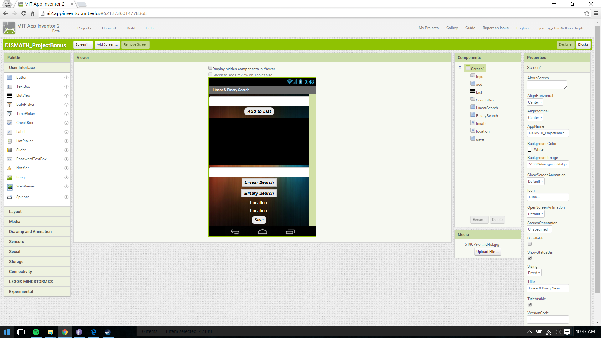
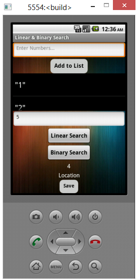
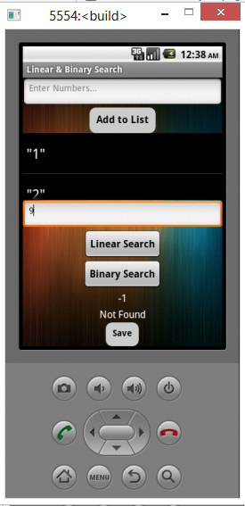
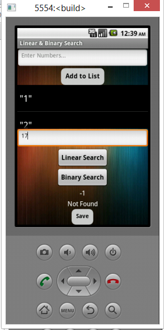

# DISMATH_ProjectBonus_Jer2j

### Designer Screenshots
- Designer Screen

### Block Screenshots
- Block for Linear Search

- Block for Binary Search

### Testing Screenshots
- Testing Linear Search (Found)

- Testing Linear Search (Not Found)

- Testing Binary Search (Found)

- Testing Binary Search (Not Found)

